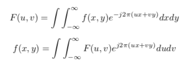

# K Space Visualization

author: Patrick Stetz ([Github](https://github.com/pstetz))

### Summary

This repo looks at how data is transformed moving from k space to image space.  This form of transformation is very common in fMRI brain imagining.

|  | 
